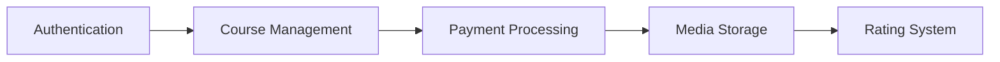

<div align="center">

# 📚 StudyNotion - EdTech Platform

### _Empowering Education Through Technology_

[](https://study-notion-zeta-lemon.vercel.app/)
[](https://github.com/WANI-OWAIS/Study-Notion)
[](LICENSE)


[✨ Features](#-key-features) • [🏗️ Architecture](#️-system-architecture) • [🚀 Quick Start](#-quick-start) • [📖 Documentation](#-api-documentation)

</div>

---

## 🎯 About The Project

**StudyNotion** is a comprehensive EdTech platform that revolutionizes online education by providing an interactive and seamless learning experience. Built with the **MERN stack** (MongoDB, Express.js, React.js, Node.js), it bridges the gap between instructors and learners worldwide.

### 🌟 Why StudyNotion?

- 🎓 **For Students**: Access quality educational content, track progress, and learn at your own pace
- 👨‍🏫 **For Instructors**: Share expertise, create engaging courses, and build a global teaching brand
- 💡 **For Everyone**: Interactive learning environment with real-time feedback and community engagement

---

## ✨ Key Features

### 👨‍🎓 Student Features

- 🏠 **Homepage** - Discover trending courses and educational content
- 📚 **Course Catalog** - Browse extensive course library with ratings and reviews
- ❤️ **Wishlist** - Save courses for later
- 🛒 **Shopping Cart** - Seamless course purchase experience
- 📺 **Video Player** - High-quality video streaming with progress tracking
- 👤 **Profile Management** - Customize your learning profile

### 👨‍🏫 Instructor Features

- 📊 **Analytics Dashboard** - Track course performance and student engagement
- 📈 **Insights** - Detailed metrics on views, enrollments, and revenue
- ✏️ **Course Management** - Create, edit, and delete courses with ease
- 💰 **Revenue Tracking** - Monitor earnings and payment history
- 🎬 **Content Upload** - Upload videos, documents, and multimedia content

### 🔐 Security & Payments

- 🔒 **Secure Authentication** - JWT-based authentication with OTP verification
- 💳 **Payment Integration** - Razorpay integration for secure transactions
- 🔑 **Password Recovery** - Forgot password with email verification
- 🛡️ **Data Protection** - Bcrypt encryption for sensitive data

---

## 📋 Table of Contents

- [🎯 About The Project](#-about-the-project)
- [✨ Key Features](#-key-features)
- [🛠️ Tech Stack](#️-tech-stack)
- [🏗️ System Architecture](#️-system-architecture)
- [🚀 Quick Start](#-quick-start)
- [⚙️ Configuration](#️-configuration)
- [📖 API Documentation](#-api-documentation)
- [📁 Project Structure](#-project-structure)
- [🤝 Contributing](#-contributing)
- [📄 License](#-license)

---

## 🛠️ Tech Stack

### Frontend


### Backend


### Additional Tools

- **Cloudinary** - Media management and optimization
- **Razorpay** - Payment gateway integration
- **JWT** - Secure authentication
- **Bcrypt** - Password encryption
- **Mongoose** - MongoDB object modeling

---

## 🏗️ System Architecture

StudyNotion follows a **client-server architecture** with three main components working in harmony:

### 🎨 Frontend Architecture

Built with **React.js** for dynamic and responsive user interfaces, ensuring an engaging learning experience.

<details>
<summary><b>📄 Student Pages</b></summary>

| Page                   | Description                                     |
| ---------------------- | ----------------------------------------------- |
| 🏠 **Homepage**        | Platform introduction with featured courses     |
| 📚 **Course Catalog**  | Complete course library with search and filters |
| ❤️ **Wishlist**        | Saved courses for future enrollment             |
| 🛒 **Cart & Checkout** | Secure course purchase flow                     |
| 📺 **Course Player**   | Video content with progress tracking            |
| 👤 **Profile**         | Account management and settings                 |

</details>

<details>
<summary><b>👨‍🏫 Instructor Pages</b></summary>

| Page                  | Description                               |
| --------------------- | ----------------------------------------- |
| 📊 **Dashboard**      | Course overview with ratings and feedback |
| 📈 **Analytics**      | Detailed metrics and insights             |
| ✏️ **Course Manager** | Create, update, and delete courses        |
| 💰 **Revenue**        | Earnings and payment history              |
| 🎬 **Content Upload** | Media management interface                |

</details>

**Frontend Technologies:**

- ⚛️ **React.js** - Component-based UI development
- 🔄 **Redux** - State management
- 🎨 **Tailwind CSS** - Utility-first styling
- 📡 **Axios** - API communication

---

### ⚙️ Backend Architecture

Powered by **Node.js** and **Express.js**, providing robust RESTful APIs for all platform operations.

#### 🔑 Core Features



| Feature               | Implementation                       |
| --------------------- | ------------------------------------ |
| 🔐 **Authentication** | JWT tokens with OTP verification     |
| 📚 **Course CRUD**    | Complete course lifecycle management |
| 💳 **Payments**       | Razorpay integration with webhooks   |
| ☁️ **Media Storage**  | Cloudinary for optimized delivery    |
| ⭐ **Ratings**        | Real-time course feedback system     |

#### 🧰 Backend Stack

- **Node.js** - Runtime environment
- **Express.js** - Web application framework
- **MongoDB** - NoSQL database
- **Mongoose** - ODM for MongoDB
- **JWT** - Token-based authentication
- **Bcrypt** - Password hashing
- **Cloudinary** - Cloud media management
- **Razorpay** - Payment gateway

---

### 🗄️ Database Design

**MongoDB** provides flexible, scalable data storage with the following schemas:

<details>
<summary><b>📊 Data Models</b></summary>

#### User Schema

```javascript
{
  name, email, password (hashed),
  accountType: [Student, Instructor],
  profile: { about, dateOfBirth, gender, contactNumber },
  courses: [courseId],
  courseProgress: [progressId]
}
```

#### Course Schema

```javascript
{
  courseName, courseDescription,
  instructor: instructorId,
  whatYouWillLearn,
  courseContent: [sectionId],
  ratingAndReviews: [reviewId],
  price, thumbnail,
  studentsEnrolled: [studentId]
}
```

#### Section & Subsection Schema

```javascript
Section: { sectionName, subSections: [subSectionId] }
SubSection: { title, description, videoUrl, duration }
```

</details>


---

### 🏛️ Architecture Diagram

Below is the high-level system architecture:


---

## 📖 API Documentation

The StudyNotion API follows **RESTful** design principles with JSON data exchange and standard HTTP methods.

### 🔌 API Endpoints Overview

<details>
<summary><b>Authentication APIs</b></summary>

- `POST /api/auth/signup` - Register new user
- `POST /api/auth/login` - User login
- `POST /api/auth/verify-otp` - OTP verification
- `POST /api/auth/forgot-password` - Password reset request
- `POST /api/auth/reset-password` - Reset password

</details>

<details>
<summary><b>Course APIs</b></summary>

- `GET /api/courses` - Get all courses
- `GET /api/courses/:id` - Get course details
- `POST /api/courses` - Create course (Instructor)
- `PUT /api/courses/:id` - Update course (Instructor)
- `DELETE /api/courses/:id` - Delete course (Instructor)

</details>

<details>
<summary><b>Payment APIs</b></summary>

- `POST /api/payment/capture` - Capture payment
- `POST /api/payment/verify` - Verify payment signature

</details>

For comprehensive API documentation, visit the [API Documentation](/api-docs).

---

## 🚀 Quick Start

### Prerequisites

Before you begin, ensure you have the following installed:

- **Node.js** (v14 or higher)
- **npm** or **yarn**
- **MongoDB** (local or Atlas)
- **Git**

### 📥 Installation

```bash
# Clone the repository
git clone https://github.com/WANI-OWAIS/Study-Notion.git

# Navigate to project directory
cd Study-Notion

# Install root dependencies
npm install

# Install server dependencies
cd server
npm install

# Return to root and install client dependencies
cd ..
npm install
```

---

## ⚙️ Configuration

### 1️⃣ Database Setup

Create a MongoDB database (local or MongoDB Atlas) and obtain your connection string.

### 2️⃣ Environment Variables

Create a `.env` file in the **server** directory:

```env
# Database
MONGODB_URL=your_mongodb_connection_string

# JWT Secret
JWT_SECRET=your_jwt_secret_key

# Cloudinary Configuration
CLOUD_NAME=your_cloudinary_cloud_name
API_KEY=your_cloudinary_api_key
API_SECRET=your_cloudinary_api_secret

# Razorpay Configuration
RAZORPAY_KEY=your_razorpay_key_id
RAZORPAY_SECRET=your_razorpay_secret

# Mail Configuration
MAIL_HOST=smtp.gmail.com
MAIL_USER=your_email@gmail.com
MAIL_PASS=your_email_password

# Frontend URL
REACT_APP_BASE_URL=http://localhost:4000/api/v1
```

### 3️⃣ Frontend Configuration

Create a `.env` file in the **root** directory:

```env
REACT_APP_BASE_URL=http://localhost:4000/api/v1
```

---

## 🎮 Usage

### Development Mode

```bash
# Start the backend server (from root directory)
cd server
npm run dev

# Start the frontend (open new terminal from root directory)
npm start
```

The application will be available at:

- **Frontend:** `http://localhost:3000`
- **Backend:** `http://localhost:4000`

### Production Build

```bash
# Build frontend for production
npm run build

# Start production server
cd server
npm start
```

---

## 📁 Project Structure

```
StudyNotion/
├── 📂 public/              # Static files
├── 📂 server/              # Backend code
│   ├── 📂 config/          # Configuration files
│   ├── 📂 controllers/     # Route controllers
│   ├── 📂 models/          # Database models
│   ├── 📂 routes/          # API routes
│   ├── 📂 middlewares/     # Custom middlewares
│   ├── 📂 utils/           # Utility functions
│   └── 📄 index.js         # Server entry point
├── 📂 src/                 # Frontend source
│   ├── 📂 components/      # React components
│   ├── 📂 pages/           # Page components
│   ├── 📂 services/        # API services
│   ├── 📂 slices/          # Redux slices
│   ├── 📂 utils/           # Helper functions
│   └── 📄 App.js           # Main App component
├── 📄 package.json         # Dependencies
└── 📄 README.md            # Documentation
```

---

## 🤝 Contributing

Contributions are what make the open-source community such an amazing place to learn, inspire, and create. Any contributions you make are **greatly appreciated**.

1. Fork the Project
2. Create your Feature Branch (`git checkout -b feature/AmazingFeature`)
3. Commit your Changes (`git commit -m 'Add some AmazingFeature'`)
4. Push to the Branch (`git push origin feature/AmazingFeature`)
5. Open a Pull Request

---

## 📄 License

Distributed under the MIT License. See `LICENSE` for more information.

---

## 📞 Contact & Support

**Team Project** - Developed by a team of 4 dedicated members

- 🌐 **Live Demo:** [StudyNotion Platform](https://study-notion-zeta-lemon.vercel.app/)
- 💼 **GitHub Repository:** [@WANI-OWAIS/Study-Notion](https://github.com/WANI-OWAIS/Study-Notion)
- 👥 **Team Size:** 4 Members
- 📧 **Contact:** Open an issue on GitHub for support

---

<div align="center">

### ⭐ Star this repository if you find it helpful!

Made with ❤️ Team J&K © 2025 Studynotion

</div>
